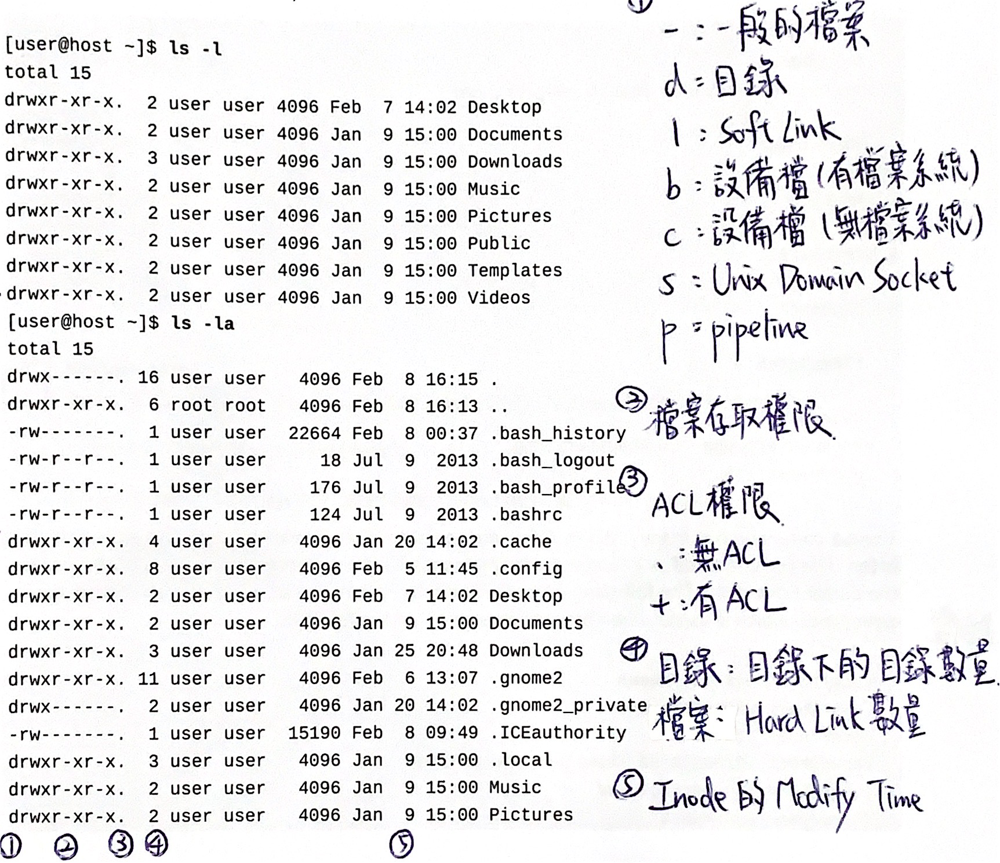
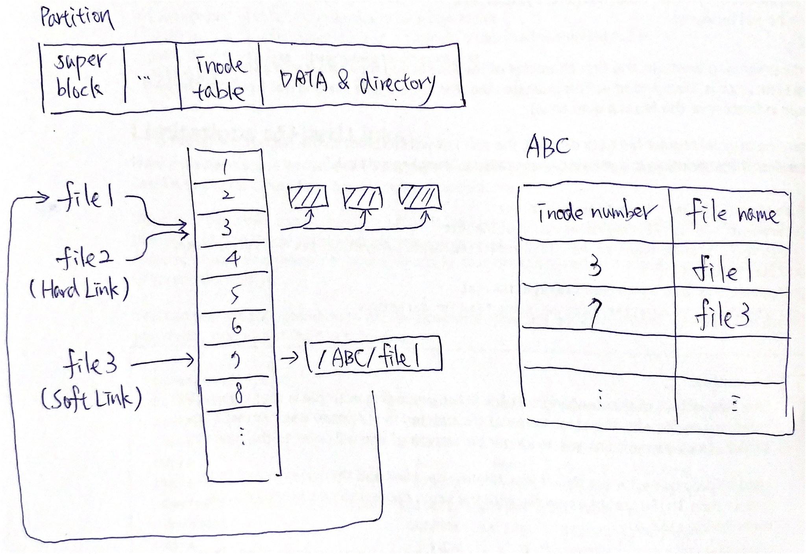

# 03 Managing Files From the Command Line
## Describing Linux File System Hierarchy Concepts
### The File-system Hierarchy
1. File-system hierarchy 檔案系統階層  
    定義了Linux作業系統中的主要目錄及目錄內容。
    
2. Home directory 家目錄  
    在多使用者作業系統上包含該系統特定使用者檔案的檔案系統目錄。
3. Important Red Hat Enterprise Linux Directories
    1. `/usr`  
        安裝的軟體、共享的套件，包含檔案和唯讀程式資料。
    2. `/etc`  
        特定系統設定檔。
    3. `/var`  
        經常異動的的檔案。
    4. `/run`  
        自上次開機以來啟動流程的即時資料，屬於系統暫存資料，對應記憶體。
    5. `/home`  
        各使用者的家目錄，儲存使用者個人資料與設定檔。
    6. `/root`  
        超級使用者(root)的家目錄。
    7. `/tmp`  
        全域可寫的暫存檔案。
    8. `/boot`  
        啟動開機流程所需的檔案。
    9. `/dev`  
        包含系統用來訪問硬體的特殊裝置文件，屬於系統暫存資料，對應記憶體。
    10. `/proc`  
        屬於系統暫存資料，對應記憶體。
    11. `/sys`  
        屬於系統暫存資料，對應記憶體。
## Specifying Files by Name
### Absolute Paths and Relative Paths
1. Absolute Paths 絕對路徑  
    一個完全確保的名稱，指定檔案系統階層結構中檔案的確切位置。
2. Relative Paths 相對路徑  
    定義一個唯一檔案，僅指定從工作目錄到達該檔案所需的路徑。
3. Working directory 工作目錄  
    使用者在作業系統內所在的目錄。
4. Linux file systems
    1. Fourth extended filesystem (ext4) 第四代擴充套件檔案系統  
        Linux系統下的日誌檔案系統，是ext3檔案系統的後繼版本。
    2. Extents file system (XFS)  
        高效能的日誌檔案系統，特別擅長處理大檔案，同時提供平滑的資料傳輸。
5. Non-Linux file systems
    1. File Allocation Table (FAT) 檔案配置表  
        微軟發明並擁有部分專利的檔案系統，供MS-DOS使用。
    2. Extended File Allocation Table (exFAT)  
        微軟開發的一種較適合於快閃記憶體的檔案系統。
        ```bash
        $ yum install fuse-exfat #安裝套件讀寫exFAT
        ```
    3. New Technology File System (NTFS)
        微軟開發的專用檔案系統，從Windows NT 3.1開始成為Windows NT家族的預設檔案系統。
        ```bash
        $ yum install ntfs-3g #安裝套件讀寫NTFS
        ```
    4. Hierarchical File System (HFS) 分層檔案系統  
        蘋果開發，並使用在Mac OS上的檔案系統。
    5. Hierarchical File System Plus (HFS+)  
        蘋果為替代他們的分層檔案系統(HFS)而開發的一種檔案系統，改善了HFS對磁碟空間的位址定位效率。
### Navigating Paths
1. Print Working Directory (pwd)
    ```bash
    $ pwd #查看工作目錄
    ```
2. Change Directory (cd)
    ```bash
    $ cd <DIRECTORY> #改變工作目錄至指定目錄(<DIRECTORY>)
    ```
    ```bash
    $ cd #改變工作目錄至家目錄
    ```
    ```bash
    $ cd ~ #改變工作目錄至家目錄
    ```
    ```bash
    $ cd - #改變工作目錄至上次工作目錄
    ```
    ```bash
    $ cd . #改變工作目錄至本層工作目錄
    ```
    ```bash
    $ cd .. #改變工作目錄至上層工作目錄
    ```
3. Touch (touch)
    ```bash
    $ touch <FILE> #建立檔案(<FILE>)
    ```
4. Index node (inode)  
    在許多類Unix檔案系統中的一種資料結構，用於描述檔案系統物件。
5. List (ls)
    
    ```bash
    $ ls #查看工作目錄下檔案名稱
    ```
    ```bash
    $ ls <PATH> #查看路徑(<PATH>)下檔案名稱
    ```
    ```bash
    $ ls -l <PATH> #查看路徑(<PATH>)下檔案名稱及詳細資訊
    ```
    ```bash
    $ ls -l <PATH> | less #查看路徑(<PATH>)下檔案名稱及詳細資訊並可上下瀏覽
    ```
    ```bash
    $ ls -a <PATH> #查看路徑(<PATH>)下包含隱藏檔案的所有檔案名稱
    ```
    ```bash
    $ ls -i <PATH> #查看路徑(<PATH>)下檔案名稱及inode編號
    ```
    ```bash
    $ ls -R <PATH> #查看路徑(<PATH>)下檔案及所有子目錄檔案名稱
    ```
## Managing Files Using Command-line Tools
### Command-line File Management
1. Make Directory (mkdir)
    ```bash
    $ mkdir <DIRECTORY> #建立日錄(<DIRECTORY>)
    ```
    ```bash
    $ mkdir -p <PATH> #建立路徑(<PATH>)上所有目錄
    ```
    ```bash
    $ mkdir <DIRECTORY1> <DIRECTORY2> #建立多個日錄(<DIRECTORY>)
    ```
2. Copy (cp)
    ```bash
    $ cp <SOURCE_FILE> <TARGET_PATH> #複製來源檔案(<SOURCE_FILE>)至目標路徑(<TARGET_PATH>)
    ```
    ```bash
    $ cp <SOURCE_FILE1> <SOURCE_FILE2> ... <TARGET_DIRECTORY> #複製多個來源檔案(<SOURCE_FILE1>, <SOURCE_FILE2>, ...)至目標目錄(<TARGET_DIRECTORY>)
    ```
    ```bash
    $ cp -r <SOURCE_DIRECTORY> <TARGET_DIRECTORY> #複製來源目錄(<SOURCE_DIRECTORY>)及所有子目錄檔案至目標目錄(<TARGET_DIRECTORY>)
    ```
    ```bash
    $ cp -p <SOURCE_FILE> <TARGET_PATH> #複製來源檔案(<SOURCE_FILE>)並保留檔案原始屬性至目標路徑(<TARGET_PATH>)
    ```
    ```bash
    $ cp -d <SOURCE_FILE> <TARGET_PATH> #複製來源檔案(<SOURCE_FILE>)並保留Soft Link至目標路徑(<TARGET_PATH>)
    ```
    ```bash
    $ cp -a <SOURCE_DIRECTORY> <TARGET_DIRECTORY> #複製來源目錄(<SOURCE_DIRECTORY>)及所有子目錄檔案、保留檔案原始屬性、保留Soft Link至目標目錄(<TARGET_DIRECTORY>)
    $ cp -r -p -d <SOURCE_DIRECTORY> <TARGET_DIRECTORY>
    ```
3. Move (mv)
    ```bash
    $ mv <SOURCE_PATH> <TARGET_PATH> #當來源路徑與目標路徑相同，重新命名來源路徑名稱(<SOURCE_PATH>)為目標路徑名稱(<TARGET_PATH>)
    ```
    ```bash
    $ mv <SOURCE_PATH> <TARGET_DIRECTORY> #當來源路徑與目標目錄不同，移動來源路徑(<SOURCE_PATH>)至目標目錄(<TARGET_DIRECTORY>)
    ```
4. Remove (rm)
    ```bash
    $ rm <FILE> #移除檔案(<FILE>)
    ```
    ```bash
    $ rm -i <FILE> #移除檔案(<FILE>)前進入交談視窗確認
    ```
    ```bash
    $ rm -f <FILE> #移除檔案(<FILE>)前不進入交談視窗確認
    ```
    ```bash
    $ rm -r <DIRECTORY> #移除目錄(<DIRECTORY>)及所有子目錄檔案
    ```
5. Remove Directory (rmdir)
    ```bash
    $ rmdir <DIRECTORY> #移除空目錄(<DIRECTORY>)
    ```
## Making Links Between Files
### Managing Links Between Files
1. Hard Link 硬連結  
    檔案系統中的多個檔案平等地共享同一個檔案儲存單元，硬連結必須在同一個檔案系統中。
2. Soft Link (Symbolic Link) 軟連結
    以絕對路徑或者相對路徑的形式指向其它檔案或者目錄的參照。
3. Hard Link and Soft Link
    
4. Link (ln)
    ```bash
    $ ln <SOURCE_FILE> <TARGET_FILE> #建立來源檔案(<SOURCE_FILE>)的目標檔案(<TARGET_FILE>)硬連結
    ```
    ```bash
    $ ln -s <SOURCE_PATH> <TARGET_PATH> #建立來源路徑(<SOURCE_PATH>)的目標路徑(<TARGET_PATH>)軟連結
    ```
5. Disk Free (df)
    ```bash
    $ df #查看檔案系統的可用磁碟空間
    ```
6. Change Directory (cd)
    ```bash
    $ cd -P <DIRECTORY> #改變工作目錄至指定目錄(<DIRECTORY>)，當指定目錄為Soft Link，則改變工作目錄至指定目錄的實際目錄
    ```
## Matching File Names with Shell Expansions
### Command-line Expansions
1. Pattern Matching 模式匹配  
    檢查提供的記號序列中，是否存在某種模式組成。
2. Metacharacters  
    具有特殊意義的字符。
3. Globbing  
    一種匹配模式，運用萬用字元來匹配一個檔案列表。
    ```bash
    $ ls * #查看零到多個任意字元的路徑下檔案名稱
    $ ls a* #查看a開頭後有零到多個任意字元的路徑下檔案名稱
    $ ls *a #查看a結尾前有零到多個任意字元的路徑下檔案名稱
    $ ls *a* #查看a前後有零到多個任意字元的路徑下檔案名稱
    ```
    ```bash
    $ ls ? #查看一個任意字元的路徑下檔案名稱
    $ ls ????? #查看五個任意字元的路徑下檔案名稱
    ```
    ```bash
    $ ls [<CHARACTERS>] #查看包含在中括號內任意一個字元(<CHARACTERS>)的路徑下檔案名稱
    $ ls *[abc]* #查看a或b或c前後有零到多個任意字元的路徑下檔案名稱
    ```
    ```bash
    $ ls [!<CHARACTERS>] #查看不包含在中括號內任意一個字元(<CHARACTERS>)的路徑下檔案名稱
    $ ls [^<CHARACTERS>] #查看不包含在中括號內任意一個字元(<CHARACTERS>)的路徑下檔案名稱
    $ ls [!abc]* #查看不是a或b或c開頭後有零到多個任意字元的路徑下檔案名稱
    $ ls *[^abc] #查看不是a或b或c結尾前有零到多個任意字元的路徑下檔案名稱
    ```
4. Echo (echo)
    ```bash
    $ echo <COMMAND> #顯示命令(<COMMAND>)
    ```
5. Tilde Expansion
    ```bash
    $ echo ~<USER> #顯示使用者(<USER>)家目錄
    $ echo ~root #顯示使用者(root)家目錄
    ```
6. Brace Expansion
    ```bash
    $ echo file{<ITEM1>, <ITEM2>, ...} #顯示多個項目(<ITEM1>, <ITEM2>, ...)
    $ echo file{1,3,5} #顯示多個項目(file1, file3, file5)
    ```
    ```bash
    $ echo file{<ITEM1>..<ITEMN>} #顯示連續項目(<ITEM1>, ..., <ITEMN>)
    $ echo file{1..3} #顯示連續項目(file1, file2, file3)
    $ echo {a..c}.txt #顯示連續項目(a.txt, b.txt, c.txt)
    ```
7. Variable Expansion
    ```bash
    $ <VARIABLE_NAME>=<VALUE> #指定變數(<VARIABLE_NAME>)的值(<VALUE>)
    $ USERNAME=operator #指定變數(USERNAME)的值(operator)
    ```
    ```bash
    $ echo ${<VARIABLE_NAME>} #顯示變數(<VARIABLE_NAME>)的值
    $ echo ${USERNAME} #顯示變數(USERNAME)的值
    ```
8. Command Substitution
    ```bash
    $ echo $(<COMMAND>) #顯示命令(<COMMAND>)替換的結果
    $ echo today is $(date +%A) #顯示命令(date +%A)替換的結果
    ```
9. Which (which)
    ```bash
    $ which <COMMAND> #查看命令(<COMMAND>)執行檔路徑
    $ which cat
    ```
10. Protecting Arguments from Expansion
    ```bash
    $ echo ${HOME} #顯示變數(HOME)的值
    $ echo \${HOME} #因跳脫字元顯示變數名稱(${HOME})
    ```
    ```bash
    $ echo file{1..3}, ${HOME}, $(hostname -s) #顯示命令(file1, file2, file3, /home/meich, meich-ubuntu)
    $ echo "file{1..3}, ${HOME}, $(hostname -s)" #因雙引號顯示命令(file{1..3}, /home/meich, meich-ubuntu)
    $ echo 'file{1..3}, ${HOME}, $(hostname -s)' #因單引號顯示命令(file{1..3}, ${HOME}, $(hostname -s))
    ```
## Return to [RH124 Red Hat System Administration I](/rh124_red_hat_system_administration_i/README.md)
