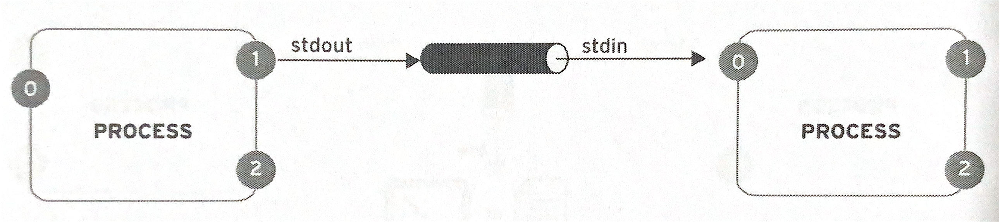
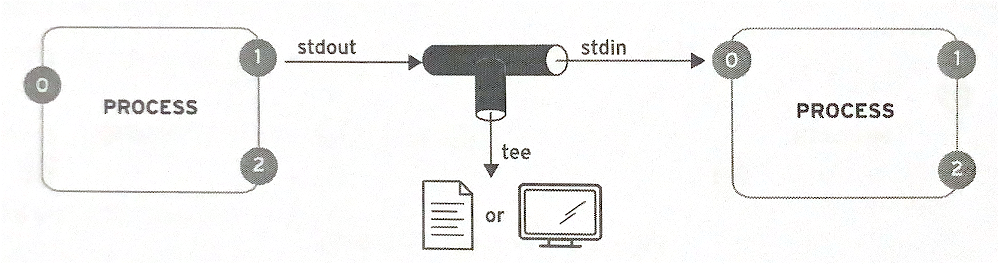
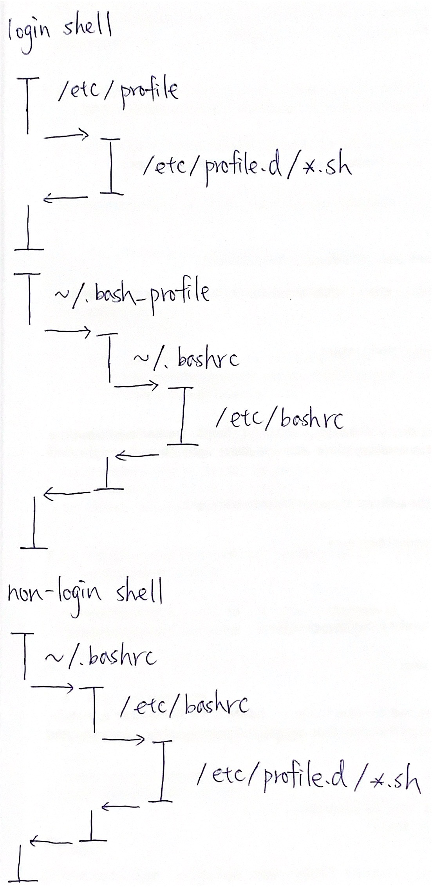

# 05 Creating, Viewing, and Editing Text Files
## Redirecting Output to a File or Program
### Standard Input, Standard Output, and Standard Error
1. File descriptors 檔案描述符  
    用於表述指向檔案的參照的抽象化概念，是一個索引值，為非負整數。
    ")
    1. Standard input (stdin) 標準輸入  
        索引值為0，預設連接輸入裝置，如鍵盤。
    2. Standard output (stdout) 標準輸出  
        索引值為1，預設連接Terminal。
    3. Standard error (stderr) 標準錯誤輸出  
        索引值為2，預設連接Terminal。
### Redirecting Output to a File
1. I/O Redirection 輸入輸出重新導向
    1. Output Redirection 輸出重新導向
        ```bash
        $ <COMMAND> > <FILE> #指令(<COMMAND>)標準輸出重新導向至覆寫檔案(<FILE>)，沒有代碼時為代碼1標準輸出
        $ <COMMAND> 1> <FILE>
        $ <COMMAND> 2> <FILE> #指令(<COMMAND>)標準錯誤輸出重新導向至覆寫檔案(<FILE>)
        $ <COMMAND> 2> /dev/null #指令(<COMMAND>)標準錯誤輸出重新導向至空裝置(/dev/null)
        ```
        ```bash
        $ <COMMAND> >> <FILE> #指令(<COMMAND>)標準輸出重新導向至附加檔案(<FILE>)，沒有代碼時為代碼1標準輸出
        $ <COMMAND> 1>> <FILE>
        ```
        ```bash
        $ <COMMAND> > <FILE> 2>&1 #指令(<COMMAND>)標準輸出重新導向至覆寫檔案(<FILE>)，標準錯誤輸出重新導向至標準輸出
        $ <COMMAND> &> <FILE> #指令(<COMMAND>)標準輸出和標準錯誤輸出重新導向至覆寫檔案(<FILE>)
        ```
        ```bash
        $ <COMMAND> >> <FILE> 2>&1 #指令(<COMMAND>)標準輸出重新導向至附加檔案(<FILE>)，標準錯誤輸出重新導向至標準輸出
        $ <COMMAND> &>> <FILE> #指令(<COMMAND>)標準輸出和標準錯誤輸出重新導向至附加檔案(<FILE>)
        ```
    2. Input Redirection 輸入重新導向
        ```bash
        $ <COMMAND> < <FILE> #檔案(<FILE>)標準輸入重新導向至指令(<COMMAND>)
        $ tr a-z A-Z #小寫轉成大寫
        $ tr a-z A-Z < /etc/passwd
        ```
### Constructing Pipelines
1. Pipeline 管道  
    是一系列將標準輸入輸出連結起來的程序，其中每一個程序的輸出被直接作為下一個行程的輸入。
    
2. Pipe
    ```bash
    $ <COMMAND1> | <COMMAND2> #指令(<COMMAND1>)標準輸出重新導向至下一個指令(<COMMAND2>)
    $ cat /etc/passwd | wc
    ```
3. Tee (tee)  
    讀取標準輸入的資料，複製一份存成檔案，並將其內容輸出到標準輸出。
    
    ```bash
    $ <COMMAND1> | tee <FILE> | <COMMAND2> #指令(<COMMAND1>)標準輸出重新導向至tee複製一份存成檔案(<FILE>)，再將標準輸出重新導向至下一個指令(<COMMAND2>)
    $ cat /etc/passwd | tee /tmp/passwd | wc
    ```
## Editing Text Files from the Shell Prompt
### Editing Files with Vim
1. Vi (vi)  
    類Unix系統都會內建vi文字編輯器。
    ```bash
    $ vi <FILE> #開啟vi文字編輯器編輯檔案(<FILE>)
    ```
2. Vim (vim)
    從vi發展出來的一個文字編輯器，代碼補全、編譯及錯誤跳轉等方便編程的功能特別豐富。
    
    ```bash
    $ vim <FILE> #開啟vim文字編輯器編輯檔案(<FILE>)
    ```
3. Command mode 命令模式
    1. `h`  
        向左移一個字元。
    2. `j`  
        向下移一個字元。
    3. `k`  
        向上移一個字元。
    4. `l`  
        向右移一個字元。
    5. `^`或`0`  
        移至行首。
    6. `$`  
        移至行尾。
    7. `gg`  
        移至頁首。
    8. `G`  
        移至頁尾。
    9. `<NUMBER>gg`  
        移至第某行(`<NUMBER>`)。
    10. `yy` (yank)  
        複製一行。
    11. `<NUMBER>yy`  
        複製多行(`<NUMBER>`)。
    12. `dd` (delete)  
        刪除一行。
    13. `<NUMBER>dd`  
        刪除多行(`<NUMBER>`)。
    14. `p` (put)  
        游標下方貼上，搭配yank複製貼上，搭配delete搬移。
    15. `P`  
        游標上方貼上，搭配yank複製貼上，搭配delete搬移。
    16. `u`  
        上一步。
    17. `Ctrl`+`r`  
        下一步。
    18. `/<STRING>`  
        向下查詢字串(`<STRING>`)。
    19. `n`  
        向下查看查詢結果。
    20. `N`  
        向上查看查詢結果。
    21. `Ctrl`+`g`  
        顯示游標所在的行與列。
4. Extended mode 擴充命令模式
    1. `:w`  
        存檔。
    2. `:x`或`:wq`  
        存檔離開。
    3. `:q`  
        離開。
    4. `:q!`  
        強制離開。
    5. `:1,$s/<STRING>/<NEW_STRING>/g`  
        以正規表達式搜尋字串(`<STRING>`)用新字串(`<NEW_STRING>`)取代。
5. Edit mode 編輯模式
    1. `i` (insert)  
        進入編輯模式，游標前方插入字元。
    2. `I`  
        進入編輯模式，游標行首插入字元。
    3. `a` (append)  
        進入編輯模式，游標後方插入字元。
    4. `A`  
        進入編輯模式，游標行尾插入字元。
    5. `o` (open)  
        進入編輯模式，游標下方插入空白行。
    6. `O`  
        進入編輯模式，游標上方插入空白行。
    7. `Esc`  
        離開編輯模式。
6. Vitual mode 視覺編輯模式
    選取與操作文字的模式。
    1. `v`  
        進入離開視覺編輯模式，多字元編輯。
    2. `V`  
        進入離開視覺編輯模式，多行編輯。
    3. `Ctrl`+`v`  
        進入離開視覺編輯模式，區塊編輯。
## Changing the Shell Environment
### Using Shell Variables
1. Shell variable
    ```bash
    $ <VARIABLE_NAME>=<VALUE> #指定變數(<VARIABLE_NAME>)的值(<VALUE>)
    ```
    ```bash
    $ echo ${<VARIABLE_NAME>} #顯示變數(<VARIABLE_NAME>)的值
    ```
2. Set (set)
    ```bash
    $ set #查看Shell變數
    ```
3. Shell variable examples
    1. History File (HISTFILE)
        ```bash
        $ echo ${HISTFILE} #顯示命令歷史紀錄存放檔案位置(HISTFILE)
        ```
    2. History File Size (HISTFILESIZE)
        ```bash
        $ echo ${HISTFILESIZE} #顯示命令歷史紀錄存放數量(HISTFILESIZE)
        ```
    3. Prompt Sign 1 (PS1)  
        命令提示字元變數。
        ```bash
        $ PS1="[\u@\h \W]\$" #指定命令提示字元(PS1)為[<USER>@<HOST> <WORK_DIRECTORY>]
        ```
        ```bash
        $ echo ${PS1} #顯示命令提示字元(PS1)
        ```
### Configuring Programs with Environment Variables
1. Environment variable 環境變數
    ```bash
    $ <VARIABLE_NAME>=<VALUE> #指定變數(<VARIABLE_NAME>)的值(<VALUE>)
    $ export <VARIABLE_NAME> #指定變數(<VARIABLE_NAME>)為環境變數
    ```
    ```bash
    $ export <VARIABLE_NAME>=<VALUE> #指定變數(<VARIABLE_NAME>)為環境變數，並指定變數的值(<VALUE>)
    ```
    ```bash
    $ echo ${<VARIABLE_NAME>} #顯示變數(<VARIABLE_NAME>)的值
    ```
2. Environment (env)
    ```bash
    $ env #查看環境變數
    ```
3. Environment variable examples
    1. Editor (EDITOR)
        ```bash
        $ EDITOR=vim #指定變數(EDITOR)的值(vim)
        $ export EDITOR #指定預設文字編輯器變數(EDITOR)為環境變數
        ```
        ```bash
        $ echo ${EDITOR} #顯示預設文字編輯器(EDITOR)
        ```
    2. Home directory (HOME)
        ```bash
        $ echo ${HOME} #顯示家目錄(HOME)
        ```
    3. Language (LANG)
        ```bash
        $ export LANG=en_US.UTF-8 #指定變數(LANG)為語系環境變數，並指定變數的值為英文(en_US.UTF-8)
        $ export LANG=zh_TW.UTF-8 #指定變數(LANG)為語系環境變數，並指定變數的值為繁體中文(zh_TW.UTF-8)
        $ export LANG=zh_CN.UTF-8 #指定變數(LANG)為語系環境變數，並指定變數的值為簡體中文(zh_CN.UTF-8)
        ```
        ```bash
        $ echo ${LANG} #顯示語系(LANG)
        ```
    4. Path (PATH)  
        在執行檔案時，在Linux只會尋找PATH底下的路徑有無此檔案可執行，不會尋找目前工作目錄。
        ```bash
        $ export PATH=${PATH}:<NEW_PATH> #指定變數(PATH)為路徑環境變數，並指定變數的值為原路徑環境變數(${PATH})加上新路徑(:<NEW_PATH>)
        ```
        ```bash
        $ echo ${PATH} #顯示路徑環境變數(PATH)
        ```
### Setting Variables Automatically
1. Exact scripts flow
    
2. Alias (alias) 別名
    ```bash
    $ alias <ALIAS>=<COMMAND> #指定別名(<ALIAS>)代表的命令(<COMMAND>)
    $ alias la="ls -la" #指定別名(la)代表查看包含隱藏檔案的所有檔案名稱及詳細資訊("ls -la")
    ```
    ```bash
    $ <ALIAS> #呼叫別名(<ALIAS>)
    $ la #呼叫別名(la)
    ```
3. Function
    ```bash
    $ function <FUNCTION>(){ 
    > <COMMAND1>
    > <COMMAND2>
    > } #指定函式(<FUNCTION>)執行多個命令(<COMMAND1>, <COMMAND2>, ...)
    $ function test(){ 
    > echo "Hello World!"
    > } #指定函式(test)執行顯示字串(echo "Hello World!")
    ```
    ```bash
    $ <FUNCTION> #呼叫函式(<FUNCTION>)
    $ test #呼叫函式(test)
    ```
### Unsetting and Unexporting Variables
1. Unset (unset)
    ```bash
    $ unset #刪除變數或函式
    ```
2. Export (export)
    ```bash
    $ export <VARIABLE_NAME> #指定變數(<VARIABLE_NAME>)為環境變數
    ```
    ```bash
    $ export -n <VARIABLE_NAME> #取消指定變數(<VARIABLE_NAME>)為環境變數
    ```
## Return to [RH124 Red Hat System Administration I](/rh124_red_hat_system_administration_i/README.md)
